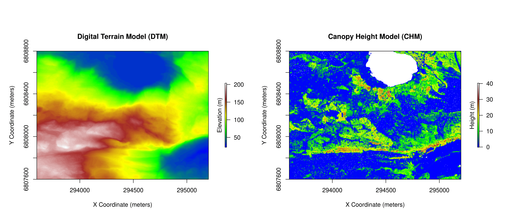

# 🌲 DeepBioFusion: Tree-Level Above Ground Biomass (AGB) Estimation using Multi-Modal Deep Learning

This repository contains the complete code and supporting material for our study on individual tree-level estimation of Above Ground Biomass (AGB) using multi-modal remote sensing data and deep learning. The proposed model does **not rely on LiDAR data for prediction**, making it suitable for operational scalability across large forested regions.

---

## 🔍 Overview

Accurate AGB estimation plays a crucial role in forest carbon accounting and ecological monitoring. Traditional approaches rely heavily on field data or LiDAR, which are costly and difficult to scale. This study introduces **DeepBioFusion**, a CNN-based architecture that fuses:

- 🛰️ Optical imagery (e.g., RGB or multispectral)
- 📡 Synthetic Aperture Radar (SAR) data (X, C, and L bands)
- 🌳 Tree species maps derived from the Norwegian Forest Inventory

---

## 🧠 Key Contributions

- 🚫 **LiDAR-free prediction**: Model predicts biomass without needing LiDAR input at inference.
- 🌐 **Scalable design**: Adaptable to any region with satellite access.
- 🌲 **Individual tree resolution**: Focused on single-tree level predictions.
- 🔁 **Reproducible workflow**: Includes complete pipeline for training and evaluation.

---

## 🧪 Methodology

The end-to-end pipeline includes segmentation, patch extraction, species labeling, and biomass estimation using a multi-branch CNN.

### 📌 Methodology Diagram
*This diagram summarizes the complete DeepBioFusion pipeline — from LiDAR segmentation to AGB prediction using CNNs and multi-modal fusion.*

<p align="center">
  
</p>

---

## 🧬 Visual Samples from the Study

### 🗺️ AGB Distribution Map
*Estimated AGB values are visualized spatially, reflecting biomass distribution across a Norwegian forested region.*

<p align="center">
  
</p>

### 🌳 Tree Species Classification Map
*Each individual tree is classified into species groups (e.g., Spruce, Pine, Deciduous), forming the categorical input for our model.*

<p align="center">
  
</p>

### 🌲 Digital Terrain Model vs Canopy Height Model
*LiDAR-derived terrain and canopy height models used for initial tree crown segmentation and quality assessment.*

<p align="center">
  
</p>


### 📊 Actual vs Predicted Biomass
*Scatter plot comparing predicted biomass values with field-based measurements. The high correlation supports model validity.*
<p align="center">
  
</p>

---

## 🧰 Setup

### 📦 Installation

```bash
git clone https://github.com/Ci2Lab/DeepBioFusion.git
cd DeepBioFusion
pip install -r requirements.txt
